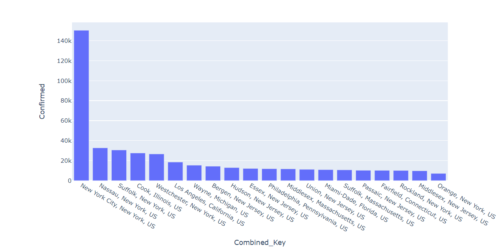

# COVID19-US-county-interactive-map

# Business Question 
- How can we visualize and better understand the overall toll of the COVID-19 pandemic on US counties or county equivalents?

# Data Visualization 
- I pulled the lastest data from JHU website and use that to visualize top 20 counties with most confirmed cases. The picture is shown below. 
- 
- The cases changing in the United States is also shown below.
- 

# Business Answer
For the trend that we saw in the data visualization, there are more confirmed cases in big cities like New York City and the surrounding area. Enforce social distancing policy would defnintely help with the current situation. For business owners in those areas, although it may be a hard time to still run the business, they can find other ways to reduce human interation while maintaining like the no-contact delivery for restaurants. In the future, if possible, I want to incorporate more data about the revenue from restaurants in the choropleth map so that we can have a better idea about how the COVID-19 would affect the dining industry. 